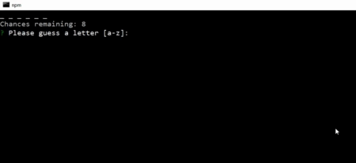

# node-word-guess-game
A lightweight command-line version of a classic word guessing game!  Users are presented with a mystery word (or phrase) and guesses the letters one at a time. 

# Installation
* From the same directory where you have cloned this github repository, run 'npm install'
* Requires the npm packages 'inquirer' and 'clear' 

# Features Include
* Easily customizeable categories using the 'wordbank' class -- simply provide a name, description, and a list of words
* Customizeable difficulty levels on a word-by-word basis
* Accomodates phrases, including special characters though the player is only required to guess letters a-z
* Never guess the same word twice within a category!

# Example Play

